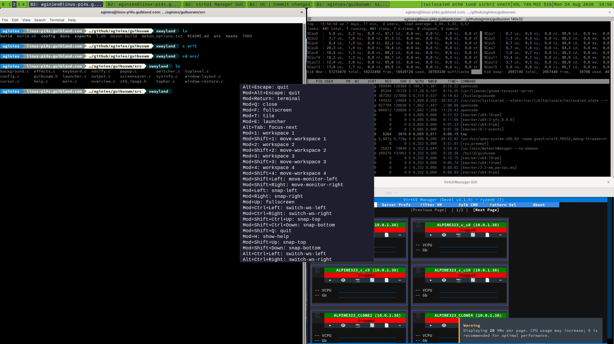

# guibuxwm

> **Vibe coding experiment** — generated by Qwen3.8-27B for testing AI-assisted development workflows.
> 503,124,547 Tokens

A simple Wayland window manager built on [wlroots 0.20](https://gitlab.freedesktop.org/wlroots/wlroots). Derived from [tinywl](https://github.com/swaywm/wlroots/tree/master/tinywl).



## Features

- **xdg-shell & XWayland:** focus, move, resize, fullscreen; X11 windows map as regular toplevels
- **Focus follows mouse** (configurable)
- **GNOME-style overview** (`F12`): all workspaces/windows visible, drag to move between workspaces
- **Tile modes** (`Mod+t`): free / left-right split / main+stack, per monitor
- **Snap to half-screen** (`Mod+Left` / `Mod+Right`)
- **Command box** (`Mod+e`): `$PATH` suggestions, up to 5 preferred apps with icons
- **Topbar** per monitor: monitor letter, workspaces, clock, network & audio indicators
- **Workspaces** per monitor (4, numbered 1–4): switch, move windows, click to switch
- **Desktop background** with per-workspace images and scale modes (stretch / fit / fill / tile)
- **Multi-monitor support:** auto or manual arrangement, move windows between monitors
- **Window position restore:** last position/size remembered per app, restored on launch
- **Session environment:** `XDG_SESSION_TYPE`, `XDG_CURRENT_DESKTOP`, `DISPLAY`/`WAYLAND_DISPLAY` injected
- **Desktop notifications:** registers as session notification daemon, bell indicator, auto-show/hide panel
- **Optional animations** for window open/close, retile, and notification panel

See [Features](docs/features.md) for full details.

## Build

```sh
./build.sh
```

`./build.sh clean` removes the `build/` directory. See [Build](docs/build.md) for requirements and manual build.

Run: `./build/guibuxwm`

## Keybindings

`Mod` is the Super key. All bindings can be changed via the config file.

| Shortcut | Action |
|---|---|
| `Mod+Return` | Start a new terminal |
| `Mod+e` | Command box: type a command, Enter runs it via `sh -c` |
| `Mod+q` | Close focused window |
| `Mod+f` | Toggle fullscreen |
| `Mod+t` | Cycle tile mode (free / split / main+stack) |
| `Alt+Tab` | Cycle window focus |
| `F12` | Toggle GNOME-style overview |
| `Mod+1..4` | Switch to workspace 1..4 |
| `Mod+Shift+1..4` | Move focused window to workspace 1..4 |
| `Mod+Ctrl+Left` / `Mod+Ctrl+Right` | Switch to previous/next workspace |
| `Mod+Shift+Left` / `Mod+Shift+Right` | Move focused window to previous/next monitor |
| `Mod+Left` | Snap focused window to left half of its monitor |
| `Mod+Right` | Snap focused window to right half of its monitor |
| `Mod+Ctrl+Shift+Up` / `Mod+Ctrl+Shift+Down` | Snap focused window to top/bottom half of its monitor |
| `Mod+Up` | Fullscreen focused window |
| `Mod+h` | Show the keybinding help overlay |
| `Mod+Shift+q` | Quit |
| `Alt+Escape` | Quit |
| `Mod+Alt+Escape` | Quit |

See [Keybindings](docs/keybindings.md) for mouse, audio, network, command box, overview, notifications, and tile modes details.

## Configuration

Configuration is via a config file, command-line flags and environment variables. Priority: command-line flag > config file > `GUIBUX_*` env > standard env > default.

**Config file:** `~/.config/guibuxwm/config` (override with `-c` flag or `GUIBUX_CONFIG` env). A sample with all defaults is in [`config/guibuxwm`](config/guibuxwm) — copy it to `~/.config/guibuxwm/config` and edit.

**Command-line flags:**

```
guibuxwm [-t terminal command] [-k keyboard layout] [-c config file]
```

| Flag | Meaning | Example |
|---|---|---|
| `-t` | Terminal command started by `Mod+Return` | `-t "gnome-terminal"` |
| `-k` | Keyboard layout (xkb layout name) | `-k fr` |
| `-c` | Path to the config file | `-c ~/.config/guibuxwm/config` |

**Environment variables:**

| Variable | Meaning | Example |
|---|---|---|
| `GUIBUX_CONFIG` | Config file path (overridden by `-c`) | `GUIBUX_CONFIG=~/wm.conf` |
| `GUIBUX_TERM` | Terminal command (overridden by `-t` and config `term`) | `GUIBUX_TERM="foot"` |
| `GUIBUX_XKB_LAYOUT` | Keyboard layout (overridden by `-k` and config `xkb_layout`) | `GUIBUX_XKB_LAYOUT="fr"` |
| `XKB_DEFAULT_LAYOUT` | Keyboard layout, standard xkb env (lowest priority) | `XKB_DEFAULT_LAYOUT="fr,us"` |
| `GUIBUX_OUTPUTS` | Manual monitor arrangement | See [Multi-monitor](docs/multi-monitor.md) |
| `GUIBUX_TEST_EXTRA_OUTPUTS` | Test-only | See [Testing](docs/testing.md) |

See [Configuration](docs/config.md) for the full reference.

## Testing

Tests run headless (no real display). Run everything:

```sh
tests/run-all.sh
```

Or individually:

```sh
tests/run-ws-test.sh [ws]        # workspace state machine (default ws 2)
tests/run-tile-test.sh <mode>    # tiling: 0=free, 1=split, 2=main+stack
tests/run-topbar-test.sh         # per-output topbar (number + time)
tests/run-audio-test.sh          # audio sysinfo poll + VOL/MIC indicators
tests/run-launcher-test.sh       # command box (show/type/enter/escape, icons)
tests/run-config-test.sh         # config file (term, keybind, colors)
tests/run-notify-test.sh         # notifications (D-Bus, auto-show, auto-hide)
tests/run-effects-test.sh        # window open/close animations
tests/run-scroll-test.sh         # scroll over VOL/MIC indicators
tests/run-altdrag-test.sh        # Alt+drag window move
tests/run-psel-test.sh           # primary selection
tests/run-resize-test.sh         # window resize
tests/run-overview-test.sh       # F12 overview
tests/run-xwayland-test.sh       # XWayland support
tests/run-restore-test.sh        # window position restore
```

See [Testing](docs/testing.md) for full details.

## License

MIT. Derived from tinywl, part of wlroots (MIT).
